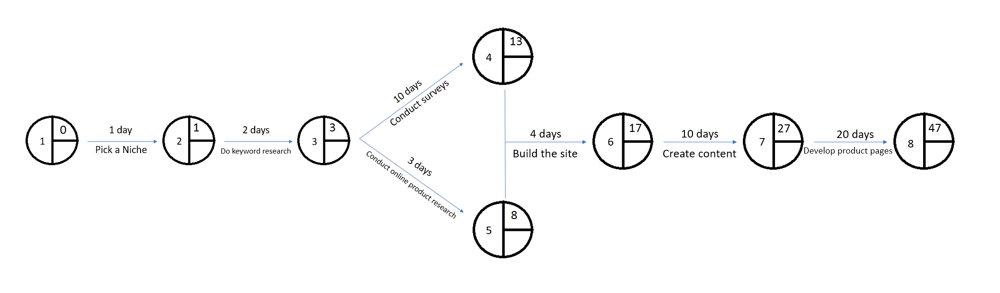

# Critical Path Analysis
A project analysis and planning method that allows a project to be completed in the shortest time possible.

### Reasons to use CPA as a business
* Large projects carry significant investment and risk
* Easily identify the relationships between the tasks required

### Information required to build one
* A list of all activities
* The duration each activity will take
* The dependencies between activities

## Network diagram
A diagram that shows the **earliest start time** (EST) and **latest finish time** (LST). It can highlight what activities can be delayed without making the project time longer ([[Float Time]]) and the activities that cannot be delayed (critical).

