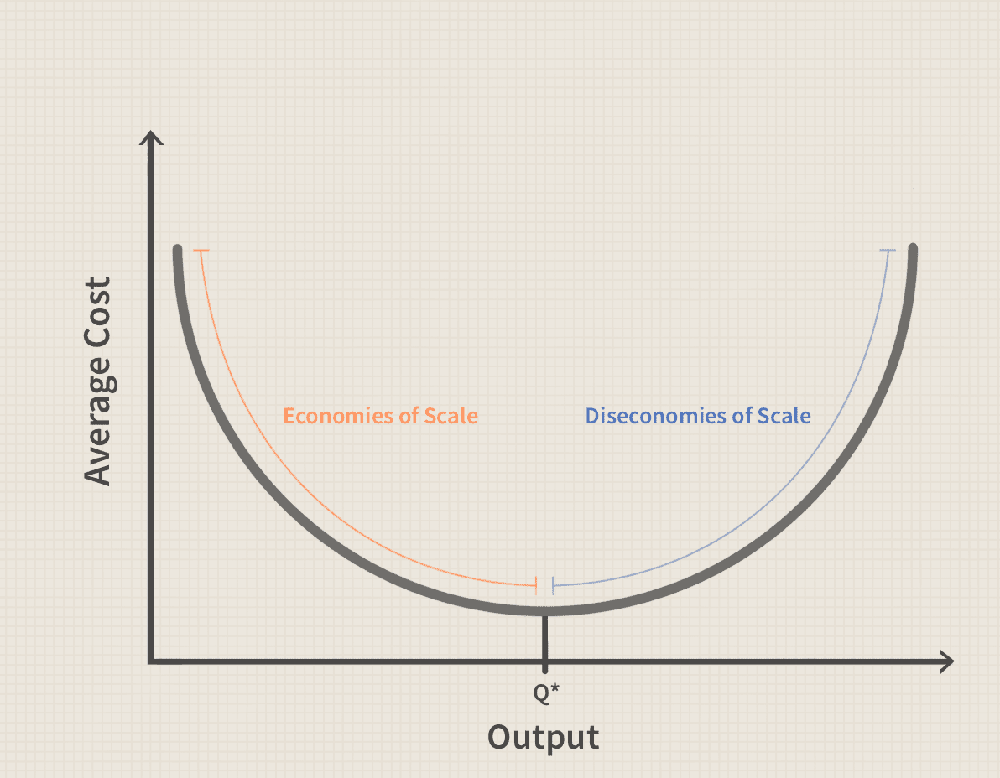

### Diseconomies of scale
Rising long-run average costs as a business expands beyond its minimum efficient scale.

##### [[Sources of Diseconomies of Scale]]

### Economies of scale
The reductions in average costs experienced by a business as output increases.

## Internal economies of scale

### Purchasing and marketing economies
Purchasing economics refers to large firms being able to get better rates when buying raw materials in bulk.

Marketing economics is the advantage of large firms, which have a lower unit cost for advertising and promotion than small firms.

### Technical economies

Technical economics arise because larger factories are often more efficient, for example: the cost of a double-decker is not the same of a decker bus.

This is because the main cost (engine and chassis) does not double as a result of doubling the capacity.

### Specialization and managerial economies

### Financial economies

### Risk-bearing economies

## External economies of scale

> #### Labor
> #### Ancillary and commercial services
> #### Co-operation
> #### Disintegration
