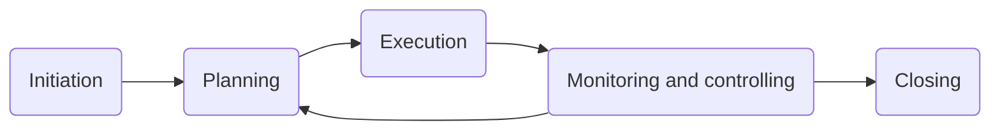
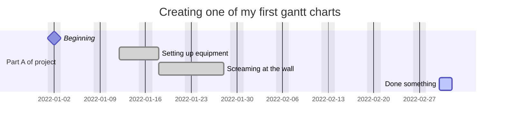

# Project Management

### Data flow diagrams
* A DFD shows the flow of data within a system, from input to output.
* A DFD shows the processing within a system and the storage.
* DFD's show human interaction with a system.

Data flow is an arrow with the direction and what the data is
Process is an action, made up of a rectangle with rounded corners
Data store is shown by a wide rectangle with a vertical line on the left

* Every data flow must be linked to a process, because something must happen to 
  the data before it can be stored or passed to an external entity.
* Each process must have at least one input and output.
* Data stores in a system must go through a process.
* Each data store should have at least one data flow in and one data flow out.

To create a **level 0** data flow, you identify the external entities and the
main data flows between the external entities and the system.

Data flow **level 0** is a basic overview of a system and the way it exchanges
data with external entities.

### At a high level it shows
* The whole system as a single process.
* All the external entities.
* Only the main data flows between the external entities and the system.
* Has a single process connected to the external entities.

### What can project management do
* Scheduling of tasks
* Allocation of resources
* Costing
* Collaborative working (calendars, shared documents, progress)
* Decision making
* A critical path

### Weaknesses of project management software
* There's often a cost associated
* Training required
* Complexity

