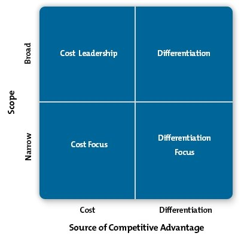

### Cost leadership
Involves striving to be the lowest-cost provider

* increasing profits, while charging market level prices
* increasing market share, whilst charging lower prices
* operates on a large scale and exploits economics of scale

Generally achieved by one business in the market, as it requires having 
a significant market share in order to achieve the low costs.

### Differentiation
Involves a business operating in a mass market with a UPS

* often focused on adding value and can be achieved through
  - quality
  - design
  - brand identity
  - customer service
* requires justifying additional costss

### Focus
Strategy involves targeting a narrow range of customers

* Cost focus
  - Emphasising cost minimisation within a focused or niche market
* Differentiation focus
  - Following different strategies within a focused market
